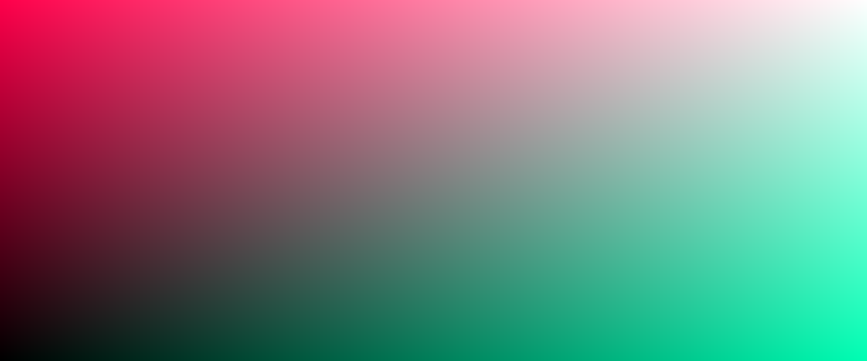
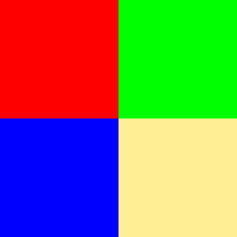
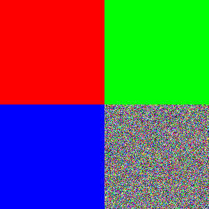

# cpp-image-generation

Programs to make bmp image files using c++

- [cpp-image-generation](#cpp-image-generation)
  - [Usage](#usage)
  - [Credit](#credit)
  - [Images](#images)
    - [Gradient](#gradient)
    - [Squares](#squares)

## Usage

| | |
| :-- | :-- |
| download (online) | [link](https://github.com/XDwightsBeetsX/cpp-image-generation) |
| download (git) | `git clone https://github.com/XDwightsBeetsX/cpp-image-generation.git` |
| `make all` | Compiles the executable file |
| `make run` | Runs the program, generating the BMP image |
| `make clean` | Removes unneeded object files |
| `make wipe` | Removes all generated files (including *.exe*) |

Distributions of *Make* can be found at [**sourceforge**](http://gnuwin32.sourceforge.net/packages/make.htm) or through [**MinGW**](https://www.mingw-w64.org/downloads/)

Code can also be compiled and run manually with `g++` compilers

## Credit

- Thanks to [Mihas Kamal's](https://stackoverflow.com/users/4684058/minhas-kamal) stackoverflow response [here.](https://stackoverflow.com/questions/2654480/writing-bmp-image-in-pure-c-c-without-other-libraries)
- Refereced the BMP image file format [here](https://web.archive.org/web/20080912171714/http://www.fortunecity.com/skyscraper/windows/364/bmpffrmt.html)

## Images

### Gradient

### Squares

| | |
| :-: | :-: |
|  |  |
