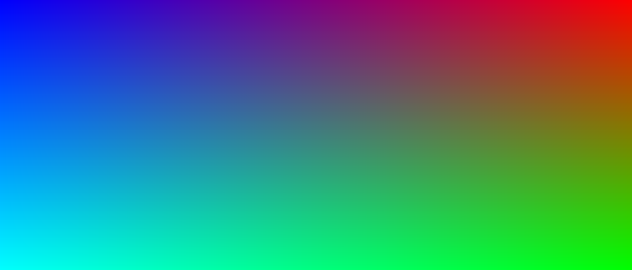
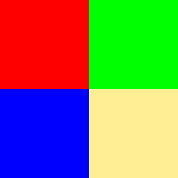
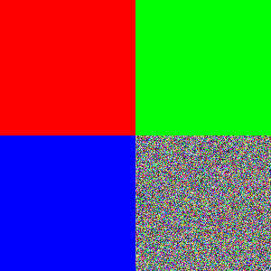
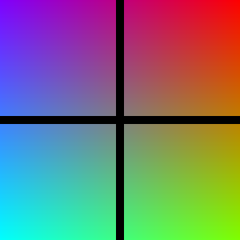

# cpp-image-generation

Programs to make bmp image files using c++

- [cpp-image-generation](#cpp-image-generation)
  - [Usage](#usage)
  - [Credit](#credit)
  - [Samples](#samples)
    - [Gradients](#gradients)
    - [Squares](#squares)

## [Usage](docs/docs.md)

1. Download Code [online](https://github.com/XDwightsBeetsX/cpp-image-generation) or from git:

    ```shell
    > git clone https://github.com/XDwightsBeetsX/cpp-image-generation
    ```

2. Modify `./main.cpp` or create your own
3. Generate the executable with `make all`
4. Run the program with `make run`

> Distributions of *Make* can be found at [**sourceforge**](http://gnuwin32.sourceforge.net/packages/make.htm) or through [**MinGW**](https://www.mingw-w64.org/downloads/). See the full list of *Make* commands [here](docs/make.md). Code can also be compiled and run manually with `g++/c++` compilers.

## Credit

- Thanks to Mihas Kamal's stackoverflow [post](https://stackoverflow.com/questions/2654480/writing-bmp-image-in-pure-c-c-without-other-libraries)
- Refereced the BMP image file format [here](https://web.archive.org/web/20080912171714/http://www.fortunecity.com/skyscraper/windows/364/bmpffrmt.html)
  - A quick note on the BMP file format headers can be found [here](docs/bmp.md)

## Samples

### Gradients

| Description | Img |
| :-: | :-: |
| `Image.toGradient()` |  |
| Red/Green Gradient |  |

### Squares

| Description | Img |
| :-: | :-: |
| `Image.toWhite()` |  |
| `Image.toBlack()` |  |
| Tiled Squares |  |
| Tiled Squares w/ random noise |  |
| `Image.toGradient(); Image.toGrid(2, 2, 10);` |  |
